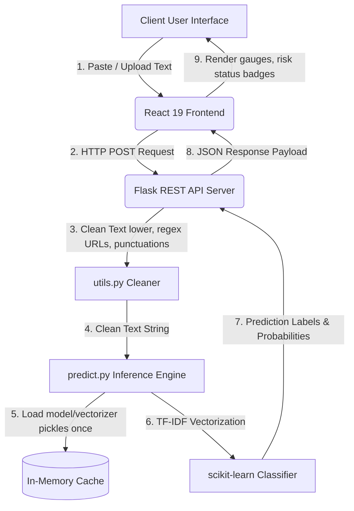

# VeriWork | Fake Job Posting Detection

An AI-powered web application capable of detecting whether a job advertisement is **Genuine** or **Fraudulent** using natural language processing (NLP) and machine learning (ML). 

This repository contains a complete, production-ready SaaS application with a **Flask API backend** serving predictions from a scikit-learn model, and a **Vite + React 19 frontend** featuring glassmorphic components, Framer Motion animations, and real-time status monitoring.

---

## Key Features
- **Instant Inference**: Analyzes job description text features in `<0.05 seconds`.
- **Radial Confidence Meter**: Glowing SVG gauge highlighting classification probability scores.
- **Diagnostics Dashboard**: Automatic and manual pinging of the backend API with latency logging.
- **Mock Model Builder**: Self-contained script to generate scikit-learn training weights out-of-the-box.
- **Client Side logs**: Prediction history logger cached inside browser local storage.
- **Premium Styling**: Sleek glassmorphism style rules with custom dark/light theme switching.

---

## System Architecture



---

## Folder Structure

```text
fake-job-posting-detection/
├── backend/
│   ├── app.py                  # Flask REST API entry point
│   ├── config.py               # Centralized configuration class
│   ├── predict.py              # ML inference and model cache logic
│   ├── utils.py                # NLP text cleansing pipeline
│   ├── model.pkl               # Serialized Logistic Regression weights
│   ├── vectorizer.pkl          # Serialized TF-IDF feature extractor
│   ├── train_mock_model.py     # Script to generate pickles on local setup
│   ├── requirements.txt        # Backend dependencies
│   └── render.yaml             # Render deployment configuration
├── frontend/
│   ├── src/
│   │   ├── components/         # Reusable widgets (toggles, meters, toast)
│   │   ├── hooks/              # Theme managers
│   │   ├── layouts/            # Base visual layout frame
│   │   ├── pages/              # Views (Home, Detector, About, Status)
│   │   ├── services/           # Axios network configurations
│   │   ├── utils/              # Sample datasets
│   │   ├── App.jsx             # Shell controller
│   │   ├── index.css           # Global Tailwind directives
│   │   └── main.jsx            # DOM bootstrapper
│   ├── index.html              # HTML shell & Google fonts loader
│   ├── postcss.config.js       # Styles preprocessing config
│   ├── tailwind.config.js      # Styling themes and layout rules
│   ├── vite.config.js          # Vite configuration
│   ├── vercel.json             # Vercel SPA routing
│   └── package.json            # Node specifications
├── .gitignore                  # Excluded folders list
└── README.md                   # System documentation
```

---

## Local Installation & Setup

### 1. Backend Setup
Make sure you have Python 3.10+ installed.

1. Navigate to the backend directory:
   ```bash
   cd backend
   ```
2. Create and activate a virtual environment:
   ```bash
   python -m venv venv
   # On Windows:
   .\venv\Scripts\activate
   # On Mac/Linux:
   source venv/bin/activate
   ```
3. Install required Python packages:
   ```bash
   pip install -r requirements.txt
   ```
4. Train the mock model to generate `model.pkl` and `vectorizer.pkl`:
   ```bash
   python train_mock_model.py
   ```
5. Spin up the Flask API local server:
   ```bash
   python app.py
   ```
   The backend API will run on `http://127.0.0.1:5000`.

---

### 2. Frontend Setup
Make sure you have Node.js 18+ installed.

1. Navigate to the frontend directory:
   ```bash
   cd ../frontend
   ```
2. Install frontend dependencies:
   ```bash
   npm install
   ```
3. Set up the local environment file. Rename `.env.example` to `.env` or create it:
   ```bash
   VITE_API_URL=http://127.0.0.1:5000
   ```
4. Start the Vite development server:
   ```bash
   npm run dev
   ```
   Open `http://localhost:3000` in your web browser.

---

## API Documentation

### 1. Health Status check
Check connectivity and ensure model binaries are cached.

- **Route**: `GET /health`
- **Response (200 OK)**:
  ```json
  {
    "status": "healthy",
    "model_loaded": true
  }
  ```

### 2. Run Job Evaluation
Submit text coordinates to assess risk labels.

- **Route**: `POST /predict`
- **Request Headers**: `Content-Type: application/json`
- **Request Body**:
  ```json
  {
    "job_description": "Work from home part-time. Earn $5000 a week. No experience needed. Immediate start! Send bank transfer details."
  }
  ```
- **Response (200 OK)**:
  ```json
  {
    "prediction": "Fake Job",
    "confidence": 92.51,
    "probability": [0.0749, 0.9251],
    "risk_level": "High",
    "processing_time": "0.0034 sec"
  }
  ```

---

## Deployment Guide

### Backend Deployment (Render)
1. Commit all files (excluding `.pkl` files and `venv/` as configured in `.gitignore`).
2. Log in to **Render** and click **New > Blueprint**.
3. Link your repository. Render will automatically parse the `backend/render.yaml` configuration:
   - **Build Command**: `pip install -r requirements.txt && python train_mock_model.py`
   - **Start Command**: `gunicorn app:app`
   - **Environment Variables**: Add your Python version, e.g., `PYTHON_VERSION=3.10.12`.

### Frontend Deployment (Vercel)
1. Log in to **Vercel** and click **Add New Project**.
2. Select your repository and navigate to the project directory settings:
   - **Framework Preset**: Vite
   - **Root Directory**: `frontend`
3. Add the Production Environment Variable:
   - **Key**: `VITE_API_URL`
   - **Value**: `https://<your-render-backend-url>` (do not include trailing slashes)
4. Click **Deploy**. Vercel will build and launch your application, parsing the redirects listed in `vercel.json`.

---

## Future Improvements
- **Contextual Embeddings**: Implement neural language features via BERT classifiers.
- **Real-Time Extension**: Introduce a browser plugin to scan job portals (LinkedIn, Indeed) automatically.
- **Cross-Domain Verification**: Query domain registrations of employers to verify company age and email origins.

---

## License
Distributed under the MIT License. See `LICENSE` for details.
